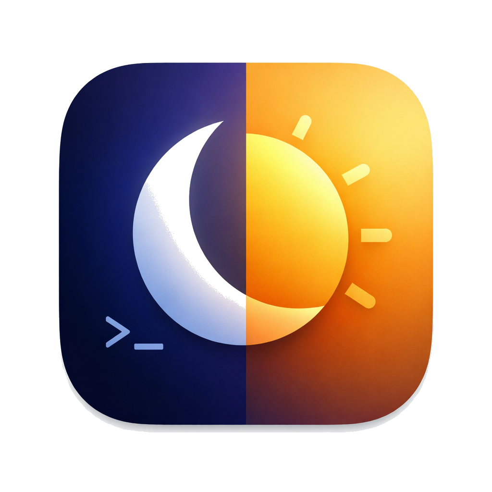

<p align="center">
  
</p>

# dark-scripter

Run scripts when macOS switches between dark and light mode.

## Install

```sh
brew install pvinis/pvinis/dark-scripter
```

Or build from source:

```sh
git clone https://github.com/pvinis/dark-scripter.git
cd dark-scripter
make install
```

## Usage

Create a config directory and add scripts:

```sh
mkdir -p ~/.config/dark-scripter
```

Add executable scripts. Each one runs with `DARKMODE=1` (dark) or `DARKMODE=0` (light) in the environment. You can have as many scripts as you like — they all run in alphabetical order on every change.

```sh
cat > ~/.config/dark-scripter/announce.sh << 'EOF'
#!/bin/bash
if [ "$DARKMODE" = "1" ]; then
  say "dark mode"
else
  say "light mode"
fi
EOF
chmod +x ~/.config/dark-scripter/announce.sh
```

```sh
cat > ~/.config/dark-scripter/notify.sh << 'EOF'
#!/bin/bash
if [ "$DARKMODE" = "1" ]; then
  osascript -e 'display notification "Switched to dark mode" with title "dark-scripter"'
else
  osascript -e 'display notification "Switched to light mode" with title "dark-scripter"'
fi
EOF
chmod +x ~/.config/dark-scripter/notify.sh
```

Scripts run in alphabetical order. Only executable files are run — non-executable files and dotfiles like `.DS_Store` are skipped.

## Running

Start as a background service (recommended way. it will start automatically on login):

```sh
brew services start dark-scripter
```

Or run once:

```sh
dark-scripter
```

## How It Works

- Listens for `AppleInterfaceThemeChangedNotification` via macOS `DistributedNotificationCenter`
- Also listens for wake notifications to catch scheduled appearance changes
- Runs scripts once on startup, then on every appearance change
- Skips re-running if the appearance hasn't actually changed

## Notes

When running under `launchd` (via `brew services`), the `PATH` is minimal (`/usr/bin:/bin:/usr/sbin:/sbin`). If your scripts use Homebrew-installed tools, add this to the top of each script:

```sh
export PATH="/opt/homebrew/bin:$PATH"
```

## License

MIT
